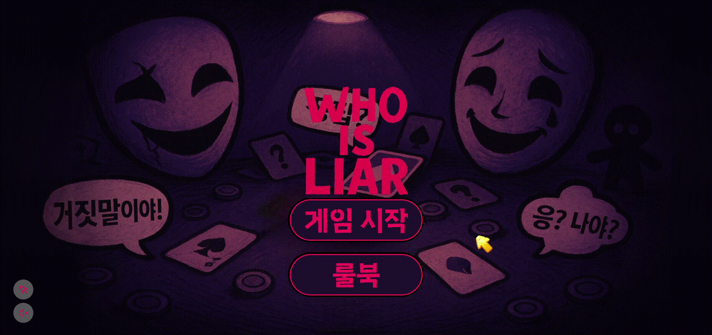
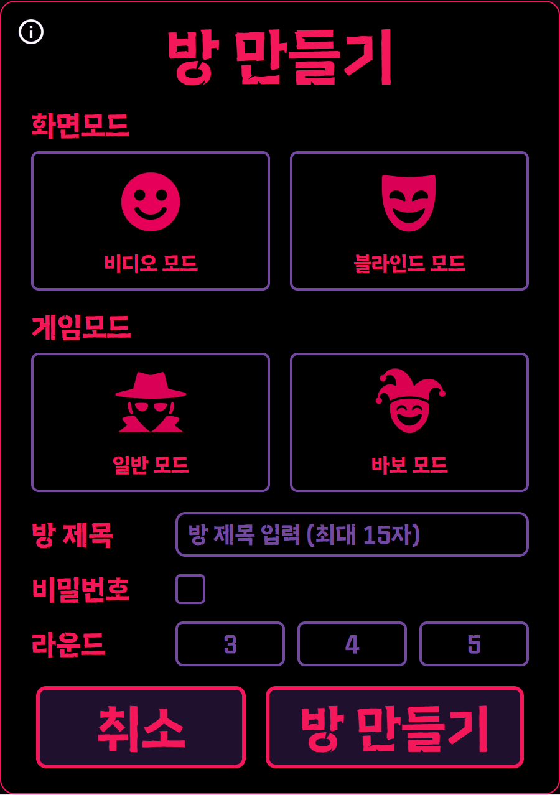
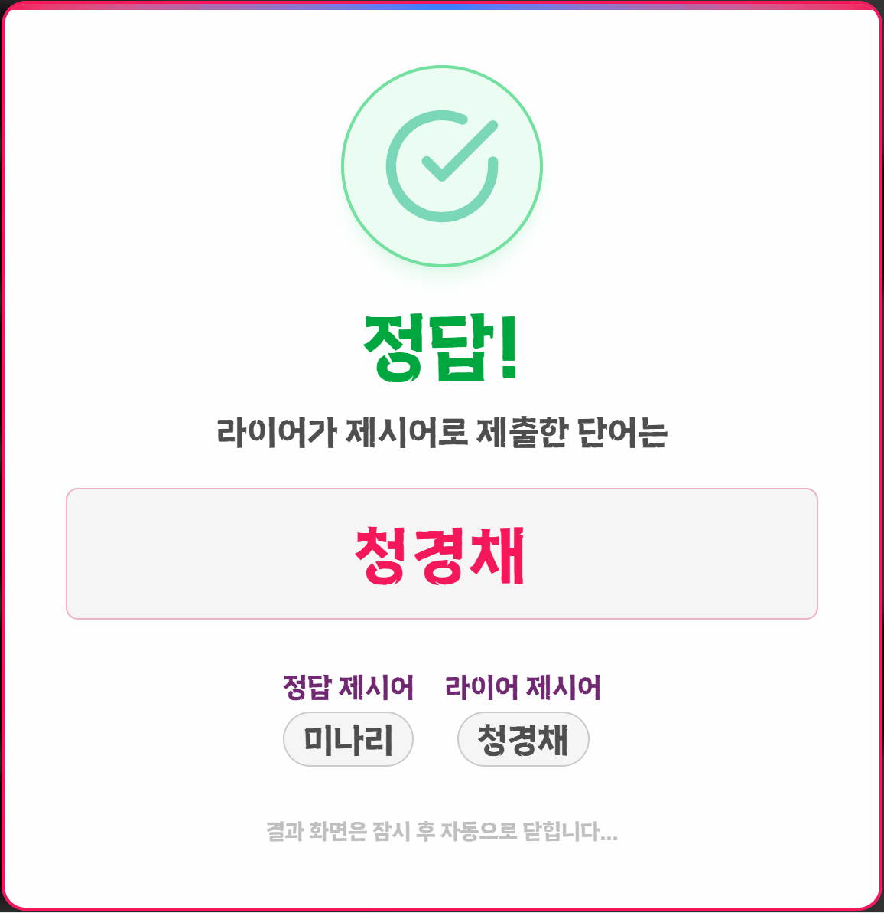
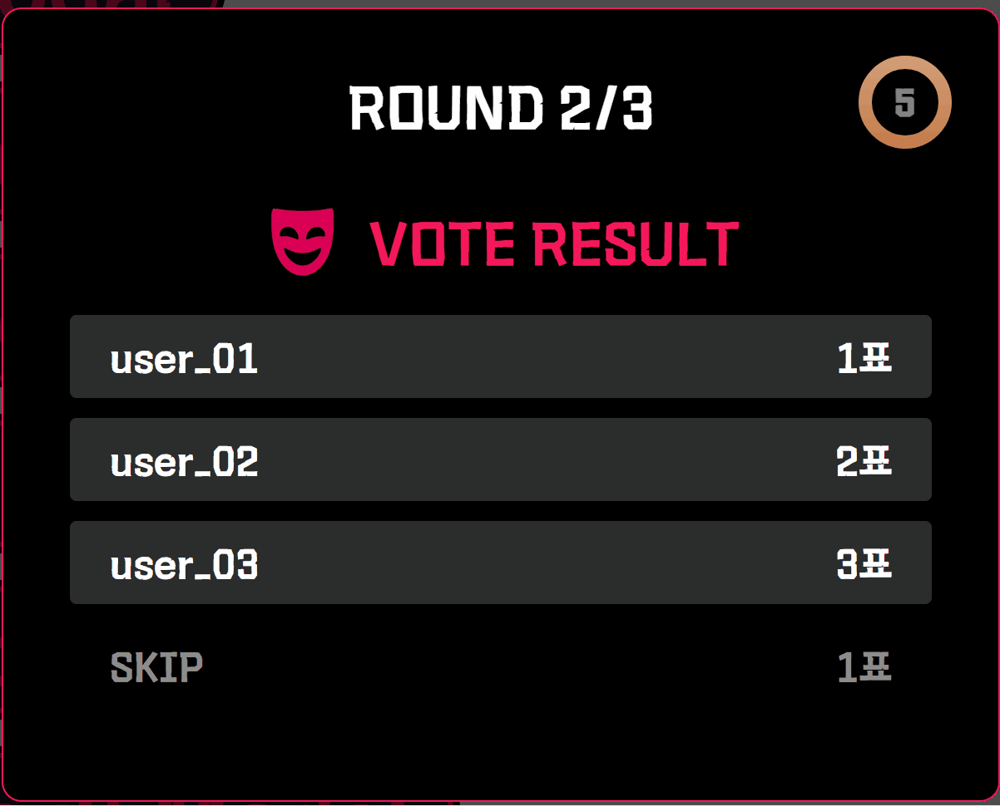
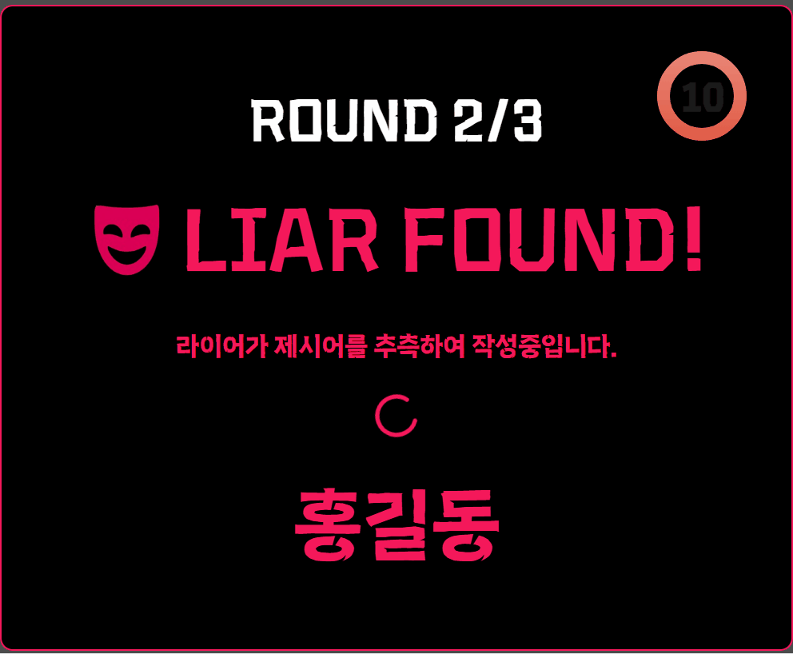
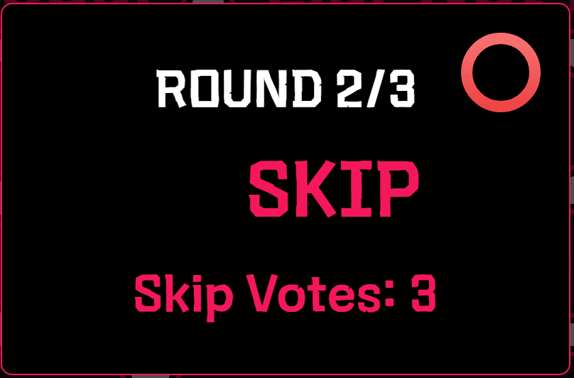
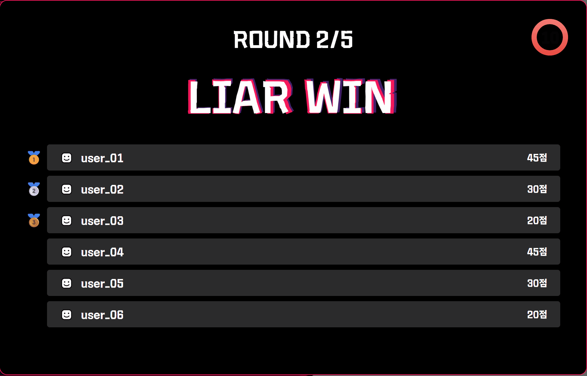
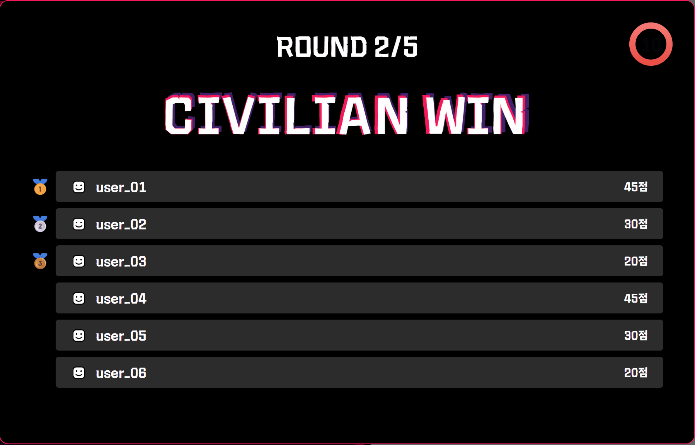
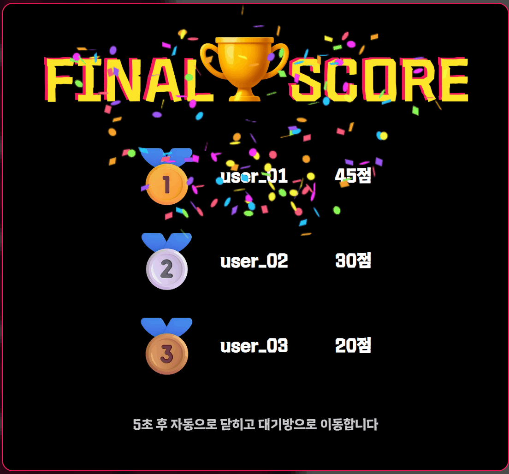

# Who Is Liar

## 프로젝트 진행 기간

**2025.04.14 ~ 2025.05.22 (6주)**

## 📌 목차

- [프로젝트 소개](#프로젝트-소개)
- [기능 소개](#기능-소개)
- [기술 스택](#기술-스택)
- [아키텍쳐](#아키텍쳐)
- [명세서](#명세서)
- [ERD](#ERD)
- [팀원](#팀원)

## ✏️프로젝트 소개
Who Is Liar는 실시간 얼굴·음성 분석으로 라이어를 찾아내는 데이터 기반 심리 추리 화상 게임입니다. 

## 🚀기능 소개
### 1. 로그인 

    

### 2. 룰북 

    

### 3. 방목록 조회 및 검색 
+ 비밀번호/코드 입장

### 4. 간편한 방 생성 및 초대 링크로 친구 초대
+ 다양한 모드 선택 지원 : 화면 모드(블라인드, 비디오), 게임 모드(일반, 바보)
+ 비번, 라운드수 설정 가능

    

### 5. 대기방 - 채팅, 카테고리 선택
+ 비디오/오디오 체크 (파동효과)
+ 준비완료(준비상태 활성화) 버튼

    

### 6. 자동 역할 배정과 개인별 제시어 전달
### 7. 채팅 진행 도움
+ 게임 진행 사회자 제공 (웹소켓)
+ 발언 턴 타이머

### 8. 실시간 표정·음성 분석(개인별 행동 로그)로 라이어 단서 제공
+ openvidu
+ 표정 : face-api 
+ 음성 : stt

### 9. 제한 시간 내 토론 후 직관적인 투표 UI 제공

    
    
    
    

### 10. 게임 결과에 따른 점수 집계 및 MVP 선정

    
    
    
    

### 11. ai 활용 - stt 요약, 제시어 수집, 바보모드 유사 제시어 수집 

## ⚙️기술 스택

<table>
    <tr>
        <td><b>Back-end</b></td>
        <td>

 

 

</td>
    </tr>
    <tr>
    <td><b>Front-end</b></td>
    <td>

 

    </td>
    </tr>
    <tr>
    <td><b>Infra</b></td>
    <td>

</td>
    <tr>
    <td><b>Tools</b></td>
    <td>
    
    
    

    </td>
    </tr>
</table>

## ⚙️아키텍쳐

## ⚙️명세서
- [기능명세서 (notion)](https://sudsy-scene-feb.notion.site/1d3e9e0919b981c3976afdcacee9a285?pvs=143)  
- [API 명세서 (notion)](https://sudsy-scene-feb.notion.site/API-1d3e9e0919b9810a85f8ec513e564b4e?pvs=143)

## ⚙️ERD

## 👥팀원
**TEAM 낭만**
- 김상욱 : 팀장(PM), BE
- 김보민 : BE, WebSocket
- 김지환 : Infra, CI/CD
- 양영조 : FE, WebSocket
- 이예원 : FE, WebRTC
- 최은영 : FE, 퍼블리싱
