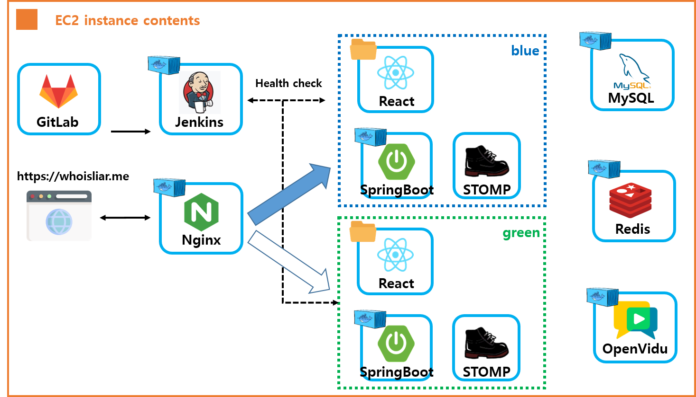

# Who Is Liar

## 프로젝트 진행 기간

**2025.04.14 ~ 2025.05.22 (6주)**

## 📌 목차

- [프로젝트 소개](#프로젝트-소개)
- [기능 소개](#기능-소개)
- [기술 스택](#기술-스택)
- [아키텍쳐](#아키텍쳐)
- [명세서](#명세서)
- [ERD](#ERD)
- [팀원](#팀원)

## ✏️프로젝트 소개
Who Is Liar는 실시간 얼굴·음성 분석으로 라이어를 찾아내는 데이터 기반 심리 추리 화상 게임입니다. 

 
WebRTC 기반 화상 채팅과 WebSocket 기반 실시간 게임 진행을 통해
몰입감 있는 라이어 게임 환경을 제공합니다.

## 🚀기능 소개
### 1. 로그인 
닉네임(2~10자) 입력만으로 간편하게 로그인할 수 있으며, 동일한 닉네임으로 중복 사용할 수 없습니다.

    

### 2. 룰북 
초보자도 쉽게 시작할 수 있도록, 게임 룰을 한눈에 확인할 수 있는 룰북을 제공합니다.
가입 후에도 플로팅 버튼을 통해 룰북을 다시 확인할 수 있습니다.

    

### 3. 방목록 조회 및 검색 
생성된 방목록을 조회, 검색할 수 있습니다.

### 4. 간편한 방 생성 및 초대 링크로 친구 초대
방 생성 시 다양한 모드를 선택할 수 있으며, 비밀번호나 코드를 통해 입장할 수 있습니다.

비디오 모드에는 화면을 공유하는 비디오 모드, 카메라를 끄고 하는 블라인드 모드,
게임 모드에는 라이어에게 제시어를 알려주지 않는 일반 모드, 라이어에게 다른 제시어를 알려주는 바보 모드를 제공합니다.

비밀번호나 라운드수도 선택 가능합니다.

    

### 5. 대기방 - 채팅, 카테고리 선택
참가자는 채팅을 통해 소통하여 제시어 카테고리를 선택할 수 있습니다.
비디오/오디오 상태도 체크 가능하며 준비 버튼을 누르면 방장에게 게임 시작 버튼이 활성화됩니다.

    

### 6. 자동 역할 배정과 개인별 제시어 전달
3~6인으로 진행하여 한명이 라이어로 지정되고 선택한 카테고리에 맞는 제시어를 전달받습니다.

### 7. 채팅 진행 도움
게임 진행을 돕기 위해, 웹소켓 기반의 사회자 기능이 제공되며 각 참가자의 발언 순서를 안내하는 턴 타이머가 함께 표시됩니다.

### 8. 실시간 표정·음성 분석(개인별 행동 로그)로 라이어 단서 제공
① OpenVidu를 활용한 실시간 화상 기능 
② 참가자의 표정을 분석하는 face-api 
③ 음성을 텍스트로 변환하는 STT 기술 
위 3가지 기술을 통해 개인별 행동 로그를 생성하고, 이를 기반으로 라이어를 추리할 수 있는 단서를 제공합니다.

    

### 9. 제한 시간 내 토론 후 직관적인 투표 UI 제공

    

    

    
    

    
    

### 10. 게임 결과에 따른 점수 집계 및 MVP 선정

    
    

    

### 11. ai 활용 
AI는 다음 기능에 활용되었습니다. 
① STT 기반 발언 내용 요약 
② 게임에 사용된 제시어 수집 
③ 바보 모드용 유사 제시어 수집 

## ⚙️기술 스택

<table>
    <tr>
        <td><b>Back-end</b></td>
        <td>

 

      

</td>
    </tr>
    <tr>
    <td><b>Front-end</b></td>
    <td>

 

 
      
      
      
      
    </td>
    </tr>
    <tr>
    <td><b>Infra</b></td>
    <td>

</td>
    <tr>
    <td><b>Tools</b></td>
    <td>
    
    
    

    </td>
    </tr>
</table>

## ⚙️아키텍쳐

    

## ⚙️명세서
- [기능명세서 (notion)](https://sudsy-scene-feb.notion.site/1d3e9e0919b981c3976afdcacee9a285?pvs=143)  
- [API 명세서 (notion)](https://sudsy-scene-feb.notion.site/API-1d3e9e0919b9810a85f8ec513e564b4e?pvs=143)

## ⚙️ERD

## 👥팀원
**TEAM 낭만**
- 김상욱 : 팀장(PM), BE
- 김보민 : BE, WebSocket
- 김지환 : Infra, CI/CD
- 양영조 : FE, WebSocket
- 이예원 : FE, WebRTC
- 최은영 : FE, 퍼블리싱
